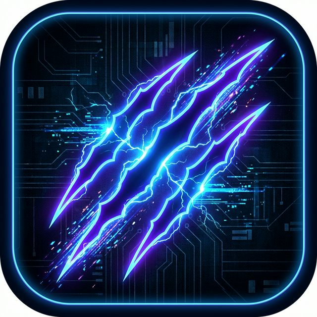
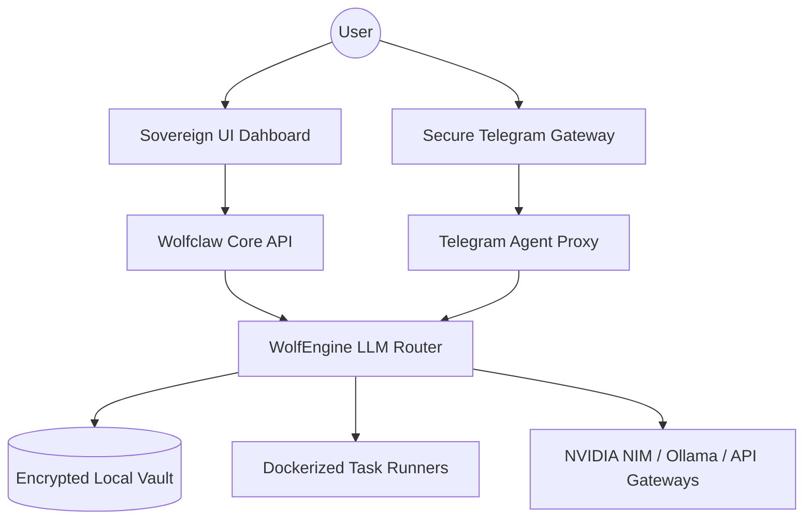

# Wolfclaw: The Sovereign AI Agent Orchestrator

<div align="center">
  
</div>

[](LICENSE)
[](https://www.python.org/)
[]()
[]()
[](SECURITY.md)
[](CONTRIBUTING.md)

**Wolfclaw** is your personal command center for private AI agents. It lets you build and manage a team of smart bots that live on your own computer, keeping your data safe and private while helping you automate your work.

Think of Wolfclaw as a secure "digital office." Instead of just one generic chatbot, you can have a whole team of specialized assistants—one for writing, one for research, one for technical work—all working together for you in a way that respects your privacy.

---

## What can Wolfclaw do for you?

Wolfclaw is built for people who want the power of AI without the risks of sharing their data.

*   **Total Privacy**: Everything stays on your machine. Your thoughts, files, and secrets are never sent to a big tech company's cloud. 
*   **Smart Memory**: Unlike other AI, Wolfclaw agents actually "remember" you. They get better at their jobs as they learn how you work and what you prefer.
*   **Visual Control**: Use a beautiful, easy-to-understand dashboard to see how your bots are thinking. It’s like having a "War Room" for your projects.
*   **Fast and Local**: If you have a powerful computer, you can run everything for free without paying for expensive monthly subscriptions. 

---

---

## Global Ecosystem Positioning (Market Differentiation)

While the broader ecosystem is populated with various "agentic kernels" and "channel gateways," Wolfclaw occupies a unique **Orchestration Tier** that separates it from standard AI implementations.

| Feature Layer | Standard Assistant Kernels | Channel Gateways | **Wolfclaw (Sovereign Orchestration)** |
| :--- | :--- | :--- | :--- |
| **Identity Model** | Basic Prompting | Session-Based | **Persistent Digital Souls (`SOUL.md`)** |
| **Logic Scoping** | Stateless Scripts | Connectivity-Focused | **Visual Strategy "War Rooms"** |
| **Resource Footprint** | Bloated or Ultra-Lean | Variable | **Optimized Full-Lifecycle Multiplexing** |
| **Security Surface** | App-Level Checks | Permission Lists | **Hardware-Level Isolated Sandboxing** |
| **Execution Goal** | Chat & Information | Message Delivery | **Autonomous System Workflows** |

### The "Wolfclaw" Difference
- **Beyond Wrappers**: Unlike tools that simply connect LLMs to chat apps, Wolfclaw is a full-stack **Orchestrator**. It doesn't just pass messages; it manages the *intent*, *memory*, and *evolution* of your agents.
- **Strategic Visualization**: Most agent platforms are CLI-bound or one-dimensional. Wolfclaw introduces the **Visual Strategy Room**, allowing you to see and modify the reasoning chains of your "Pack" in real-time.
- **Evolutionary State**: Where others reset after a session, Wolfclaw agents grow. Every interaction is committed to a local, encrypted knowledge vault, ensuring your agents become more specialized to your specific world with every task.
- **Elite Performance**: We bridge the gap between "ultra-lean" binaries (which lack reasoning depth) and "heavy" frameworks (which lack speed). Wolfclaw is optimized for high-throughput, premium reasoning.

---

## Architecture Overview

The Wolfclaw engine utilize a high-performance multiplexing layer for maximum throughput and agent responsiveness.



For technical specifications, see the [Technical Guide (guide.md)](guide.md).

---

## Deployment

### Prerequisites
- Python 3.11 or higher
- Node.js 22+ (for enterprise UI features)
- Docker (recommended for secure task isolation)

### Installation
1.  **Clone the pack**:
    ```bash
    git clone https://github.com/zetaaztra/wolfclaw.git
    ```
2.  **Initialize environment**:
    ```bash
    pip install -r requirements.txt
    ```
3.  **Awaken the orchestrator**:
    ```bash
    python desktop_launcher.py
    ```

### Distribution Formats
For users requiring pre-packaged environments, Wolfclaw is available in the following formats:
- **Windows Executable (`.exe`)**: Optimized for modern Windows 10/11 environments.
- **Windows Legacy**: Specialized build for older systems with restricted dependencies.
- **Debian Package (`.deb`)**: Native integration for Linux-based sovereign workstations.

---

## Legal Framework & Disclaimers

### CYBERSECURITY WARNING & USER RESPONSIBILITY
**By deploying Wolfclaw or using its binary distributions (.exe, .deb, .msi), you explicitly acknowledge and agree to the following:**

1.  **High-Risk Execution Intelligence**: Wolfclaw is an autonomous agentic framework capable of executing low-level terminal commands, modifying system registries (in Windows Legacy builds), and managing network traffic. If misconfigured or used without oversight, it poses a **significant cybersecurity threat** to your host machine and network.
2.  **Binary Integrity**: While official builds are provided for convenience (.exe for Windows, .deb for Linux), the act of running autonomous agents with system-level access is inherently dangerous. You assume full responsibility for the integrity of your environment.
3.  **Command Authorization**: You are **solely and exclusively responsible** for the actions taken by agents. The "Digital Soul" configuration grants the AI the power to interact with your OS; you must audit all agent behaviors.
4.  **No Guarantee of Accuracy**: AI-generated logic is non-deterministic. The developers do not guarantee that agent actions will be safe, predictable, or error-free.

### LIMITATION OF LIABILITY
**IN NO EVENT SHALL THE DEVELOPERS , CONTRIBUTORS, OR AFFILIATED PARTIES BE LIABLE FOR ANY DAMAGES WHATSOEVER** (including, without limitation, direct, indirect, special, incidental, or consequential damages; loss of data, profits, or business interruption) arising out of the use of or inability to use this software, even if advised of the possibility of such damage. This software is provided **"AS IS"** and any express or implied warranties are disclaimed.

---

## Support & Development

Wolfclaw is a labor of obsession towards digital freedom. To support the mission and the development of the sovereign AI ecosystem, please see our support page.

- **[Support & Development](SUPPORT.md)**: Contribution channels and mission details.

---

## Credits & Attributions

Wolfclaw draws inspiration from the pioneering work of the open-source community, specifically:
- **OpenClaw**: For the conceptual foundations of agentic orchestration.
- **Pravin A Mathew**: Lead Architect and primary developer of the Wolfclaw Sovereign Pack.

---

## License & Governance

Wolfclaw is a professional-grade project governed by international standards.

- **[License](LICENSE)**: MIT License.
- **[Security Policy](SECURITY.md)**: Vulnerability disclosure and reporting.
- **[Contributing](CONTRIBUTING.md)**: Guidelines for involvement.
- **[Code of Conduct](CODE_OF_CONDUCT.md)**: Community standards.
- **[Changelog](CHANGELOG.md)**: History of evolution.

Copyright (c) 2026 . All rights reserved.

---
*Wolfclaw: Developed with Vision by Pravin A Mathew*
<!-- Ref: PAM-Sovereign-Orchestration-v2 -->
