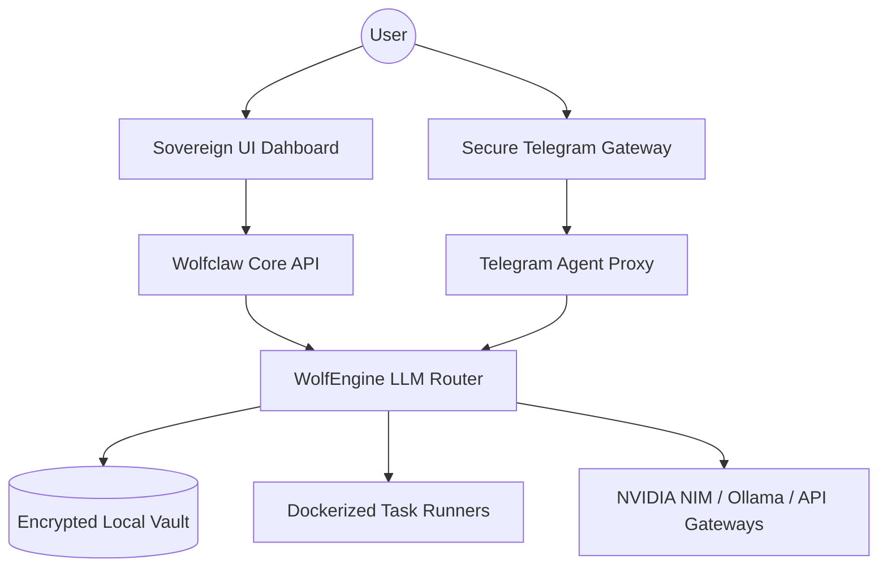

# Wolfclaw: The Sovereign AI Agent Orchestrator

<div align="center">
  
</div>

[](LICENSE)
[](https://www.python.org/)
[]()
[]()
[](SECURITY.md)
[](CONTRIBUTING.md)

**Wolfclaw** is your personal command center for private AI agents. It lets you build and manage a team of smart bots that live on your own computer, keeping your data safe and private while helping you automate your work.

Think of Wolfclaw as a secure "digital office." Instead of just one generic chatbot, you can have a whole team of specialized assistants—one for writing, one for research, one for technical work—all working together for you in a way that respects your privacy.

---

## What can Wolfclaw do for you?

Wolfclaw is built for people who want the power of AI without the risks of sharing their data.

*   **Total Privacy**: Everything stays on your machine. Your thoughts, files, and secrets are never sent to a big tech company's cloud. 
*   **Smart Memory**: Unlike other AI, Wolfclaw agents actually "remember" you. They get better at their jobs as they learn how you work and what you prefer.
*   **Visual Control**: Use a beautiful, easy-to-understand dashboard to see how your bots are thinking. It’s like having a "War Room" for your projects.
*   **Fast and Local**: If you have a powerful computer, you can run everything for free without paying for expensive monthly subscriptions. 
*   **Plugin App Store**: Browse and instantly install community-built tools, scripts, and capabilities directly into your orchestrator.
*   **Proactive Agents**: Set up "invisible" agents that run autonomously in the background, monitoring your data or environment without needing a prompt.
*   **Multi-Agent Swarms**: Group bots into structured "crews." A Manager bot breaks down your complex tasks and delegates work to its Sub-bots to solve massive problems in parallel.

---

---

## Global Ecosystem Positioning (Market Differentiation)

While the broader ecosystem is populated with various "agentic kernels" and "channel gateways," Wolfclaw occupies a unique **Orchestration Tier** that separates it from standard AI implementations.

| Feature Layer | Standard AI Kernels | Channel Gateways | **Wolfclaw (Sovereign Orchestration)** |
| :--- | :--- | :--- | :--- |
| **User Focus** | **Developers & CLI-Users** | Integration Specialists | **Common People & Home Users** |
| **Interface** | Terminal / Code-Only | API-Based | **Intuitive GUI Dashboard** |
| **Identity Model** | Basic Prompting | Session-Based | **Persistent Digital Souls (`SOUL.md`)** |
| **Logic Scoping** | Stateless Scripts | Connectivity-Focused | **Visual Strategy "War Rooms"** |
| **Execution Goal** | Chat & Information | Message Delivery | **Autonomous System Workflows** |

### The "Wolfclaw" Difference (GUI vs. CLI)
While other "claws" and agent frameworks are built for developers who live in a terminal, **Wolfclaw is built for everyone.** 

- **Accessibility First**: You don't need to know how to write code or use a command prompt. Our logic is wrapped in a premium, glassmorphic GUI that makes managing complex AI as easy as using a standard office app.
- **Visual Intelligence**: Instead of cryptic logs, you get a visual workspace. Watch your agents think, plan, and execute in real-time through the Sovereign Dashboard.
- **The "Everyman" Agent**: From automating your personal finances to managing your household schedule, Wolfclaw brings the "Digital Soul" paradigm to the everyday user, not just the elite developer.
- **Strategic Visualization**: Most agent platforms are CLI-bound or one-dimensional. Wolfclaw introduces the **Visual Strategy Room**, allowing you to see and modify the reasoning chains of your "Pack" in real-time.
- **Evolutionary State**: Where others reset after a session, Wolfclaw agents grow. Every interaction is committed to a local, encrypted knowledge vault, ensuring your agents become more specialized to your specific world with every task.
- **Elite Performance**: We bridge the gap between "ultra-lean" binaries (which lack reasoning depth) and "heavy" frameworks (which lack speed). Wolfclaw is optimized for high-throughput, premium reasoning.

---

## Architecture Overview

The Wolfclaw engine utilize a high-performance multiplexing layer for maximum throughput and agent responsiveness.



For technical specifications, see the [Technical Guide (guide.md)](guide.md).

---

## Deployment

### Prerequisites
- Python 3.11 or higher
- Node.js 22+ (for enterprise UI features)
- Docker (recommended for secure task isolation)

### Installation
1.  **Clone the pack**:
    ```bash
    git clone https://github.com/zetaaztra/wolfclaw.git
    ```
2.  **Initialize environment**:
    ```bash
    pip install -r requirements.txt
    ```
3.  **Awaken the orchestrator**:
    ```bash
    python desktop_launcher.py
    ```

### Distribution Formats
For users requiring pre-packaged environments, Wolfclaw is available in the following formats:
- **Windows Executable (`.exe`)**: Optimized for modern Windows 10/11 environments.
- **Windows Legacy**: Specialized build for older systems with restricted dependencies.
- **Debian Package (`.deb`)**: Native integration for Linux-based sovereign workstations.

> [!TIP]
> For instructions on how to build these distributions from source, see the **[Build Guide](BUILD_GUIDE.md)**.

---

---

## 🐺 The Wolfclaw Fleet

| Fleet Distribution | Platform | Core Use Case | Primary Interface |
| :--- | :--- | :--- | :--- |
| **Native (.exe)** | Windows | Full Desktop OS Control | Webview GUI + API |
| **Linux (.deb)** | Ubuntu/Debian | Server/Workstation Control | Webview GUI + CLI |
| **CLI** | All | Terminal-first Automation | Shell / Powershell |
| **Streamlit / Vite** | Cloud/Local | Web-based Orchestration | Browser-based GUI |
| **Legacy** | All | Modular / Core Library | Source-only / API |

### 🛠️ Feature Matrix (Fleet Parity)

| Feature | Native (.exe) | Linux (.deb) | CLI | Streamlit | Legacy |
| :--- | :---: | :---: | :---: | :---: | :---: |
| **Multi-Agent Chat** | ✅ | ✅ | ✅ | ✅ | ✅ |
| **Flow Orchestration** | ✅ | ✅ | ✅ | ✅ | ✅ |
| **Macro Recorder/Sovereign** | ✅ | ✅ | ❌ | ❌ | ✅ |
| **Plugin Marketplace** | ✅ | ✅ | ✅ | ✅ | ✅ |
| **Real-Time Activity Feed** | ✅ | ✅ | ✅ | ✅ | ✅ |
| **Webhook Triggers** | ✅ | ✅ | ✅ | ✅ | ✅ |
| **Bot Export/Import** | ✅ | ✅ | ❌ | ✅ | ✅ |
| **Conversation Memory Search** | ✅ | ✅ | ✅ | ✅ | ✅ |
| **Clipboard Agent** | ✅ | ✅ | ❌ | ❌ | ✅ |
| **Scheduled Tasks** | ✅ | ✅ | ❌ | ✅ | ✅ |
| **Voice I/O (TTS/STT)** | ✅ | ✅ | ❌ | ✅ | ❌ |
| **Screenshot-to-Task (VLM)** | ✅ | ✅ | ❌ | ✅ | ✅ |
| **Multilingual Prompts** | ✅ | ✅ | ✅ | ✅ | ✅ |
| **Remote SSH Control** | ✅ | ✅ | ✅ | ✅ | ✅ |

---

## Support & Development

Wolfclaw is a labor of obsession towards digital freedom. To support the mission and the development of the sovereign AI ecosystem, please see our support page.

- **[Support & Development](SUPPORT.md)**: Contribution channels and mission details.

---

## Credits & Attributions

Wolfclaw is built upon and draws deep inspiration from:
- **OpenClaw**: The original architecture and implementation that discovered the paradigms of local-first agentic orchestration.
- **Sovereign AI Community**: For the continued evolution of digital freedom tools.

---

## License & Governance

Wolfclaw is a professional-grade project governed by international standards.

- **[Legal Disclaimer](DISCLAIMER.md)**: Important cybersecurity and liability information.
- **[License](LICENSE)**: MIT License.
- **[Security Policy](SECURITY.md)**: Vulnerability disclosure and reporting.
- **[Contributing](CONTRIBUTING.md)**: Guidelines for involvement.
- **[Code of Conduct](CODE_OF_CONDUCT.md)**: Community standards.
- **[Changelog](CHANGELOG.md)**: History of evolution.

Copyright (c) 2026 Zeta Aztra Technologies. All rights reserved.

---
*Wolfclaw: Crafted with Vision for Sovereign AI by Pravin A Mathew*
<!-- Author: Pravin A Mathew | Zeta Aztra Technologies -->
