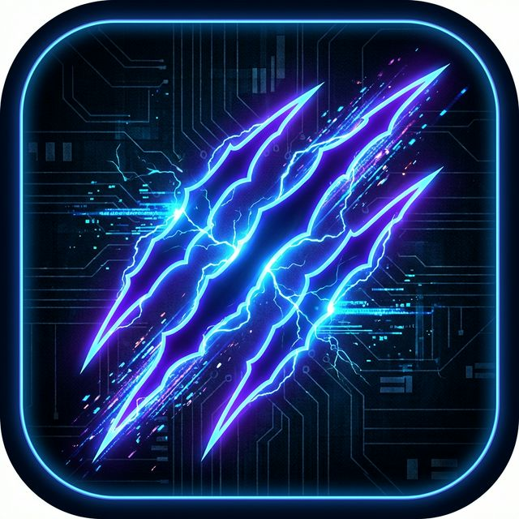

# Wolfclaw: The Sovereign AI Agent Orchestrator

<div align="center">
  
  <br>
  <h3>"One Pack. All Bases. Total Sovereignty."</h3>
</div>

[](LICENSE)
[](https://www.python.org/)
[]()
[]()

**Wolfclaw** is not just a chatbot. It is a **Sovereign AI Command Center** designed for those who demand the power of an elite AI agent workforce without sacrificing privacy or simplicity. It is the ultimate evolution of the "Claw" paradigm, bridging the gap between professional automation and everyday usability.

---

## 🏗️ Project Status: Transparency Notice
Wolfclaw is a massive, multi-fleet undertaking. While the core engine is robust and production-ready, we believe in radical transparency:

> [!IMPORTANT]
> **UNDER CONSTRUCTION**: Some advanced "Fleet" features (such as **Multi-Agent Swarms** and **Proactive Background Agents**) are currently in **Experimental/Concept** phase. If a specific advanced button seems non-responsive or returns a "Coming Soon" message, it is because we are still perfecting the safety and logic layers for that feature. 
> 
> **The Pack Evolves Daily**: We are developing at light-speed. If a feature isn't working for you today, check back next week—evolution is our only constant.

---

## 🏆 Why Wolfclaw? (The Competitive Edge)
In an ecosystem filled with "OpenClaw," "Claude-Claw," and other developer-centric tools, why should you choose **Wolfclaw**?

### 1. Built for the Non-Developer (The GUI Revolution)
Most "Claws" require you to live in a black-and-white terminal, writing code just to talk to your agent. **Wolfclaw is built for everyone.**
- **No Terminal Required**: Our premium, glassmorphic GUI allows you to manage tasks, plugins, and bots with a single click.
- **Visual Intelligence**: Instead of reading lines of code, you see a visual "War Room" where you can watch your agents' reasoning chains in real-time.

### 2. Covering All Bases (The 5-Fleet Unified Engine)
While other projects focus on only one interface, Wolfclaw covers the entire spectrum of use cases:
- **The Native Explorer (EXE)**: A powerful, high-performance desktop app.
- **The Linux Sovereign (DEB)**: Native integration for professional workstations.
- **The Command Master (CLI)**: For the power users who demand speed.
- **The Web Gateway (Streamlit)**: Access your orchestrator from any browser.
- **The Legacy Core**: A lightweight version for maximum compatibility.

### 3. All-In-One Sovereignty
Other tools are "kernels" that require you to piece together your own infrastructure. Wolfclaw provides the **Full Stack**:
- **Encrypted Local Database**: Your data never leaves your machine.
- **Universal App Integrations**: Control your PC, search the web, and manage remote servers from one box.
- **Self-Healing Automation**: Our Vision-based clicking system remembers *what* you clicked, so if an app moves or changes, the bot finds it.

---

## 🧩 The 90-Plugin Army: Why Plugins?
A common question is: *"Why do I need a plugin if the AI is smart?"* 

The answer is **Efficiency, Speed, and Precision.** While a "Generic AI" can try to figure things out, a **Wolfclaw Plugin** acts as a specialized "Tool Belt" for your bots.

### What Plugins Do for You:
1. **Reduce Mental Load (Tokens)**: Instead of the AI having to constantly "think" about how to format a CSV or audit a server, it calls a pre-built plugin. This makes the AI **faster** and **cheaper** (uses fewer tokens).
2. **Deterministic Results**: AI can hallucinate. Plugins cannot. When you use the `SQL_Builder` or `SSL_Checker` plugin, you get 100% accurate results every time.
3. **Bridge the Physical Gap**: Some plugins allow the AI to interact with software it couldn't normally see, like local CRM databases or specialized engineering software.

**The Army Tiers**: From **Home Users** (Tier 0) to **Security Researchers** (Tier 7), we have 90 pre-validated modules ready to be "slot-loaded" into your bots' brains.

---

## 🛠️ Real-World Proof: "Does it really work?"
**YES.** Wolfclaw is not a toy; it is a system administrator's best friend.

**Example Scenario: Remote DevOps Automation**
- **You ask**: *"Check my server at 123.45.67.8. If Jenkins isn't installed, install it, set up a basic admin user, and give me the login URL."*
- **The Process**:
    1. Wolfclaw uses the `Remote SSH` tool to log in.
    2. It executes commands to check for Jenkins.
    3. It identifies the OS, downloads the packages, and configures the firewall.
    4. It scrapes the initial password and presents it to you in a clean table.
- **The Result**: You just did 30 minutes of manual work in 30 seconds of chatting.

---

## 📸 Technical Capability Matrix

| Feature | Wolfclaw (Sovereign) | Standard "Claws" | ChatGPT/Online AI |
| :--- | :---: | :---: | :---: |
| **Privacy (Local-First)** | **💯 Guaranteed** | ⚠️ Partial | ❌ None |
| **PC Control (Vision)** | **Native/Built-in** | ❌ Manual Setup | ❌ Impossible |
| **90+ Plugin Marketplace** | **One-Click Install** | ❌ None | ⚠️ Limited |
| **Cross-Fleet Sync** | **CLI + Web + EXE** | ❌ CLI Only | ❌ None |
| **Remote Server SSH** | **Production-Ready** | ⚠️ Code-Only | ❌ Restricted |
| **Sovereign Vault** | **PBKDF2 Encrypted** | ❌ Plaintext | ❌ Cloud Only |

---

## 📥 Getting Started

### 1. Download
Visit the [Releases](https://github.com/zetaaztra/wolfclaw/releases) page to grab the version that fits your life.
- **First-Time Users**: Highly recommend the `.exe` for a "one-click" experience.

### 2. Build from Source
For those who want to see under the hood, follow the **[Master Build Guide (BUILD_MASTER.md)](BUILD_MASTER.md)**.

### 3. Quick Install (CLI)
```bash
git clone https://github.com/zetaaztra/wolfclaw.git
pip install -r requirements.txt
python desktop_launcher.py
```

---

## ⚖️ Legal & Security
Wolfclaw is built on the principles of **Digital Freedom**. However, with great power comes great responsibility.
- Review our **[Security Audit](SECURITY.md)** results.
- Read the **[Full Disclaimer](DISCLAIMER.md)** before performing remote server operations.

---

## 📢 The Future of the Pack
We are not stopping at 5 fleets and 90 plugins. Our roadmap includes:
- **Mobile Fleet**: Control your pack from your phone.
- **Sovereign Cloud**: Zero-knowledge syncing between your devices.
- **Deep-Vision 2.0**: Even faster GUI automation.

---

© 2026 Zeta Aztra Technologies. Refined by obsession for the Sovereign AI User.
*Wolfclaw: Crafted with Vision by Pravin A Mathew*
